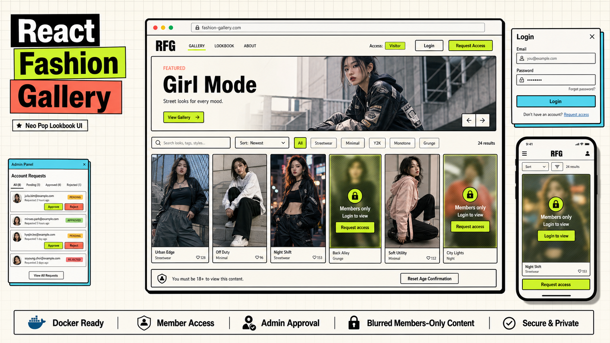

# React Fashion Gallery



一个可使用 Docker 部署的图片展示网站。前端使用 Vite + React，生产环境由 Node/Express 同时提供静态页面和 `/api/*` 接口；用户、会话和访客申请信息存储在 SQLite 数据库中。

## 功能概览

- 年龄确认页：访客进入站点前需要确认年龄/访问资格。
- 图片展示：支持搜索、标签过滤、排序、特色图和灯箱预览。
- 访客浏览：未登录访客可以浏览公开图片。
- 受限图片：配置为会员可见的图片会对访客模糊显示，登录后可正常查看。
- 用户登录：使用服务端 session 和 HttpOnly Cookie。
- 首个管理员：新数据库首次启动时，可在网页中创建第一个管理员。
- 账号申请：访客可提交账号申请，管理员审批后创建会员账号。
- 管理面板：管理员可查看、批准、拒绝访客账号申请。

## 技术栈

- 前端：React、Vite、Lucide React
- 后端：Node.js、Express
- 数据库：SQLite（`better-sqlite3`）
- 登录与会话：bcryptjs、HttpOnly Cookie session
- 测试：Vitest、Testing Library
- 部署：Docker

## 本地开发

先安装依赖：

```bash
npm install
```

启动前端开发服务器：

```bash
npm run dev
```

默认会启动 Vite 开发服务，可在浏览器中打开终端输出的本地地址，例如：

```text
http://127.0.0.1:5173/
```

如果需要使用生产同款 Express 服务进行本地调试，先构建前端：

```bash
npm run build
```

然后启动服务端：

```bash
DATABASE_PATH=./data/app.db PORT=8080 npm start
```

打开：

```text
http://127.0.0.1:8080/
```

本地 SQLite 数据库会写入 `./data/app.db`。

## Docker 部署

构建镜像：

```bash
docker build -t react-fashion-gallery .
```

启动容器：

```bash
docker run --rm -p 8080:8080 -v gallery-data:/data react-fashion-gallery
```

打开网站：

```text
http://localhost:8080/
```

说明：

- 容器内服务端口默认为 `8080`。
- `-p 8080:8080` 表示将本机 `8080` 映射到容器 `8080`。
- `-v gallery-data:/data` 会创建 Docker volume，用来持久化 SQLite 数据库。
- 数据库文件位于容器内 `/data/app.db`。
- 删除容器不会删除 `gallery-data` volume，因此用户、会话和申请记录会保留。

后台运行示例：

```bash
docker run -d \
  --name react-fashion-gallery \
  -p 8080:8080 \
  -v gallery-data:/data \
  react-fashion-gallery
```

查看日志：

```bash
docker logs react-fashion-gallery
```

停止容器：

```bash
docker stop react-fashion-gallery
```

## 首次使用流程

1. 使用 Docker 或本地 Express 启动网站。
2. 打开网站并通过年龄确认页。
3. 如果数据库中还没有用户，顶部会显示 **Create First Admin**。
4. 点击 **Create First Admin**，填写管理员昵称、邮箱、密码，并勾选确认项。
5. 创建成功后会自动登录为管理员。
6. 后续访客不能再创建首个管理员，只能使用 **Request Access** 提交账号申请。

## 访客申请账号

访客在未登录状态下点击 **Request Access**，需要填写：

- Display name：昵称
- Email：邮箱
- Contact：联系方式
- Reason：申请原因
- 年龄/访问资格确认
- 规则确认

提交后系统只会记录申请信息，不会自动创建账号。申请需要管理员审批。

## 管理员审批账号

管理员登录后点击顶部 **Admin**，进入账号申请管理面板。

管理员可以：

- 查看所有申请
- 批准 pending 状态的申请
- 拒绝 pending 状态的申请

批准申请时，系统会要求管理员输入该新用户的初始密码。批准成功后：

- 系统创建一个 `member` 用户
- 申请状态变为 `approved`
- 该用户可以使用邮箱和初始密码登录

拒绝申请后，申请状态变为 `rejected`。

## 图片配置

图片配置文件位于：

```text
public/images.json
```

基本结构示例：

```json
{
  "site": {
    "title": "Girl Mode",
    "notice": "Content notice text.",
    "restrictedTags": ["members", "private"]
  },
  "images": [
    {
      "id": "tokyo-night",
      "src": "/images/tokyo-night.svg",
      "title": "Tokyo Night",
      "location": "Tokyo",
      "photographer": "Studio Sample",
      "date": "2026-04-12",
      "tags": ["street", "night", "lookbook"],
      "visibility": "members",
      "description": "Image description."
    }
  ]
}
```

每张图片至少需要：

- `id`
- `src`
- `title`
- `tags`，且至少包含一个标签

本地图片应放在：

```text
public/images/
```

然后使用 `/images/文件名` 的方式引用，例如：

```json
"src": "/images/example.jpg"
```

## 受限图片规则

图片会在以下任一情况下被视为受限图片：

- 图片字段包含 `"visibility": "members"`
- 图片的 `tags` 命中了 `site.restrictedTags`

例如：

```json
{
  "site": {
    "restrictedTags": ["members", "private"]
  }
}
```

则包含 `members` 或 `private` 标签的图片会对访客模糊显示。登录用户可以正常查看。

## 环境变量

| 变量 | 默认值 | 说明 |
| --- | --- | --- |
| `PORT` | `8080` | Express 服务监听端口 |
| `DATABASE_PATH` | `/data/app.db` | SQLite 数据库路径 |
| `SESSION_COOKIE_NAME` | `gallery_session` | 登录 Cookie 名称 |
| `SESSION_TTL_DAYS` | `14` | 会话有效天数 |
| `COOKIE_SECURE` | `false` | 设置为 `true` 且 `NODE_ENV=production` 时 Cookie 使用 Secure |

HTTPS 部署时建议：

```bash
docker run -d \
  --name react-fashion-gallery \
  -p 8080:8080 \
  -v gallery-data:/data \
  -e NODE_ENV=production \
  -e COOKIE_SECURE=true \
  react-fashion-gallery
```

注意：`COOKIE_SECURE=true` 适合 HTTPS 环境。如果只是本地 HTTP 测试，不要开启。

## 测试与构建

运行所有测试：

```bash
npm test
```

构建前端：

```bash
npm run build
```

本地启动生产服务：

```bash
npm start
```

健康检查：

```bash
curl http://127.0.0.1:8080/api/health
```

预期返回：

```json
{"ok":true}
```

## API 快速检查

未登录用户状态：

```bash
curl http://127.0.0.1:8080/api/auth/me
```

预期：

```json
{"user":null}
```

图库访问状态：

```bash
curl http://127.0.0.1:8080/api/gallery-access
```

示例：

```json
{
  "authenticated": false,
  "role": null,
  "restrictedTags": ["members", "private"]
}
```

## 数据备份与重置

如果使用 Docker volume：

```bash
docker volume ls
```

本项目示例 volume 名称为：

```text
gallery-data
```

删除数据库并重置站点：

```bash
docker volume rm gallery-data
```

删除后再次启动容器，会进入“创建首个管理员”的初始状态。

## 内容与合规说明

本项目只提供图片展示、登录、账号申请和基础访问控制功能，不包含：

- 图片抓取
- 图片上传审核流程
- 第三方图片授权管理
- 成人内容推荐逻辑

站点维护者需要自行确保图片来源合法、授权明确，并根据部署地区提供适当的年龄提示、访问提示和内容合规说明。
